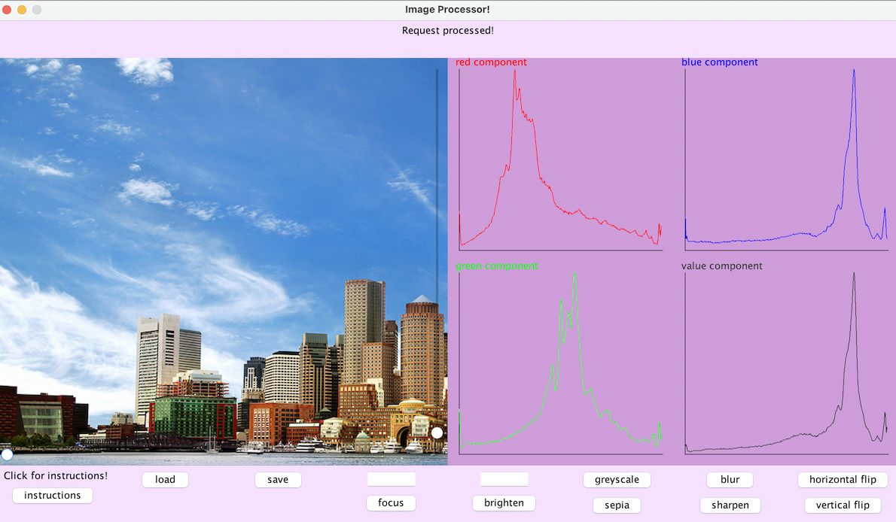

USING THE GUI:
  NOTE - ALL IMAGE COMMANDS WILL BE EXPLAINED UNDER THIS SECTION.
- If confused about how to use the image processor, start with clicking the 
  instructions button, which will show a pop up displaying instructions.
- Start with loading an image to edit. An image must be loaded before using
  editing features. Press the load button, which will show a pop up allowing 
  the user to choose a file to edit. The file must be of a supported image
  type.
- Loading the image will cause it to pop up on the left side of the center 
  portion of the screen. Appropriate histograms for red, green, blue, and value 
  components will show on the right.
- 
- The user can scroll the image left to right and up to down if it doesn't fit in the window.
- Image updates will show on the top of the screen. For example, after successfully uploading
  an image, the text on the top of the screen will update to "Request processed!"
- Any button for image editing can be chosen now. The user can pick from horizontal flip,
  vertical flip, blur, sharpen, greyscale or sepia.
- If they want to use the focus button, they first have to enter what component to focus on. 
  For example, entering red and then pressing focus will make a greyscale with the red component.
- If they want to use the brighten button, they first have to enter the amount they want to 
  brighten by. For example, entering 10 and then pressing brighten will brighten the image
  by an increment of 10. 
- After editing the image to their liking, the user can press the save button. This will show a 
  pop up allowing the user to choose where they want to save their image.
- At any point, the user can load a new image and start working with that one instead.

COMMANDS:
Our current supported operations are load, brighten, horizontal-flip, vertical-flip, red-component,
blue-component, green-component, luma-component, value-component, intensity-component, blur,
sharpen, greyscale, sepia and save. The functionality of these commands will be outlined below.

load:
- load is done with the format load imagePath imageName. This loads an image from a specific
  imagePath to the hashmap that saves all our images with the provided imageName. An image must be
  loaded before performing all other operations on it or saving it. Current support image formats
  to load are ppm, jpg, bmp, and png.

ALL FOLLOWING COMMANDS CAN ONLY BE PERFORMED IF THE IMAGE YOU'RE TRYING TO PERFORM THE EDIT ON IS
IN THE HASHMAP. THIS IS DONE BY EITHER LOADING THE IMAGE OR PERFORMING AN EDIT AND SAVING THE EDITED
IMAGE TO THE HASHMAP THROUGH THE NEW IMAGE NAME PARAMETER.

brighten:
- brighten is done in the format of brighten increment imageName newImageName. It brightens an image
- from the images hashmap with the provided imageName, and saves it into the hashmap with the
- newImage name. An image can also be darked by providing a negative increment.

horizontal-flip:
- horizontal-flip is done in the format of horizontal-flip imageName newImageName.
  It flips the image horizontally from the hashmap with the given imageName and saves it into the
  hashmap with the newImageName.

vertical-flip:
- vertical-flip is done in the format of vertical-flip imageName newImageName.
  It flips the image horizontally from the hashmap with the given imageName and saves it into the
  hashmap with the newImageName.

red-component:
- red-component is done in the format of red-component imageName newImageName. It creates a
  greyscale image from the image in the hashmap with the given imageName and saves it into the
  hashmap with the newImageName. It uses the red component of the pixels in each image and sets all
  values to that one to make the greyscale.

blue-component:
- blue-component is done in the format of blue-component imageName newImageName. It creates a
  greyscale image from the image in the hashmap with the given imageName and saves it into the
  hashmap with the newImageName. It uses the blue component of the pixels in each image and sets
  all values to that one to make the greyscale.

green-component:
- green-component is done in the format of green-component imageName newImageName. It creates a
  greyscale image from the image in the hashmap with the given imageName and saves it into the
  hashmap with the newImageName. It uses the green component of the pixels in each image and sets
  all values to that one to make the greyscale.

luma-component:
- luma-component is done in the format of luma-component imageName newImageName. It creates a
  greyscale image from the image in the hashmap with the given imageName and saves it into the
  hashmap with the newImageName. It uses the luma component of the pixels in each image and sets
  all values to that one to make the greyscale.

value-component:
- value-component is done in the format of value-component imageName newImageName. It creates a
  greyscale image from the image in the hashmap with the given imageName and saves it into the
  hashmap with the newImageName. It uses the value component of the pixels in each image and sets
  all values to that one to make the greyscale.

intensity-component:
- intensity-component is done in the format of intensity-component imageName newImageName.
  It creates a greyscale image from the image in the hashmap with the given imageName and saves it
  into the hashmap with the newImageName. It uses the intensity component of the pixels in each image
  and sets all values to that one to make the greyscale.

blur:
- blur is done in the format of blur imageName newImageName. It applies a blur filter to the image
  from the hashmap with the given imageName and saves it to the hashmap with the newImageName after
  blurring it.

sharpen:
- sharpen is done in the format of sharpen imageName newImageName. It applies a sharpen filter to
  the image from the hashmap with the given imageName and saves it to the hashmap with the
  newImageName after sharpening it.

greyscale:
- greyscale is done in the format of greyscale imageName newImageName. It creates a greyscale image
  with the image that has the given imageName in the hashmap, and saves it with the newImageName
  after transforming the colors to create a greyscale image.

sepia:
- sepia is done in the format of sepia imageName newImageName. It creates an image with a sepia
  color transformation from the image that has the given imageName in the hashmap. It then saves
  it with the newImageName after transforming the colors to create an image with sepia transformed
  colors.

save:
- save is done in the format of save imagePath imageName. It saves an image from the hashmap with
  the given imageName to the givenImagePath. It currently supports ppm, jpg, png, and bmp image
  formats. 

